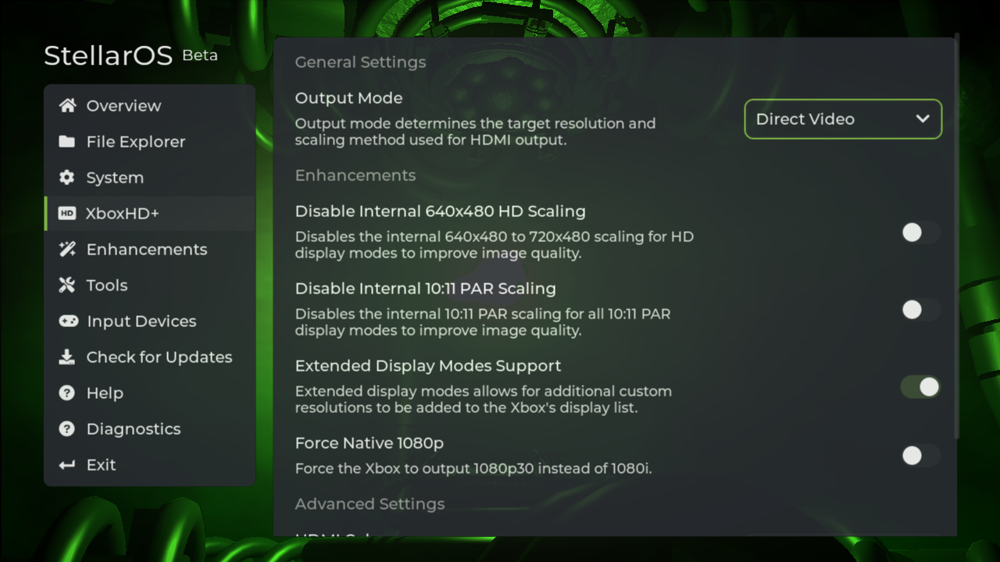
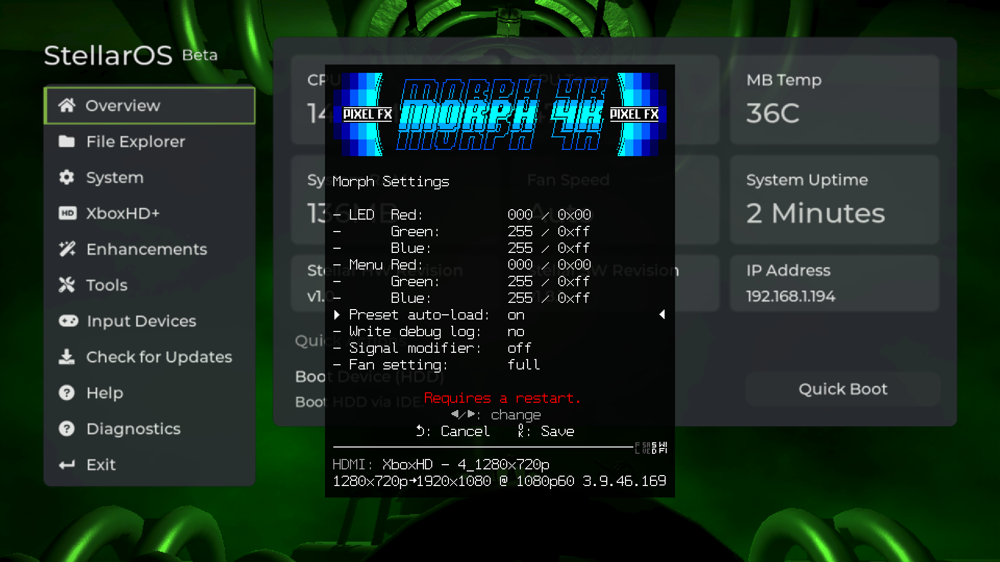
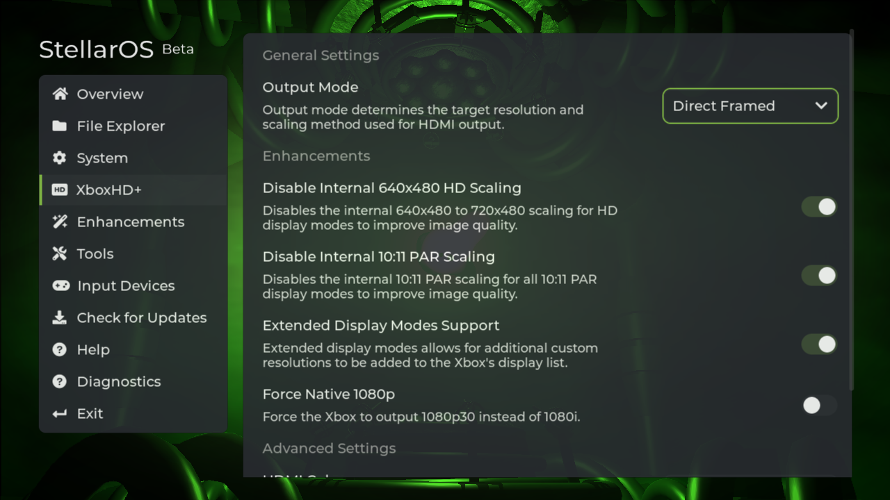
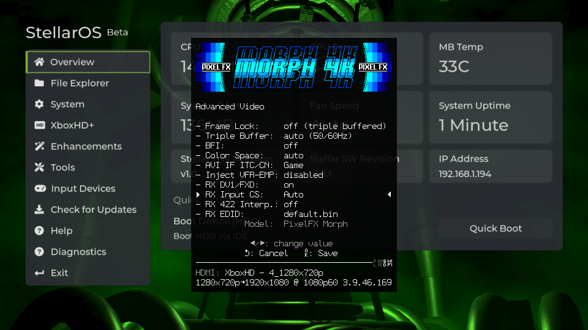

# Stellar XboxHD+ - Upscaler Profiles
<p >
 <a href=""></a>
 <a href="https://github.com/MakeMHz/project-stellar/issues"></a>
 <a href=""></a>
</p>

> stellar (adj) - exceptionally good; outstanding.

The world's most powerful add-on for the Original Xbox. StellarOS is the first completely legal re-implementation of the retail Xbox BIOS.

# RetroTink 4K
Currently, the RetroTink 4K does not support auto profile loading via SPD metadata. This feature has been requested. For now, the recommended
configuration is as follows.



| **Setting**                             | **Value**    |
|-----------------------------------------|------------- |
| **Output Mode**                         | Direct Video |
| **Disable Internal 640x480 HD Scaling** | Off          |
| **Disable Internal 10:11 PAR Scaling**  | Off          |

# PixelFX Morph
It is recommended to download the profile pack from the release page and copy to the profiles to the SD card of the PixelFX Morph.
Once copied over, you will need to enable ``Preset auto-load``.

\* All profiles are optimized for 4K.



It is recommended that you set the following settings.



| **Setting**                             | **Value**     |
|-----------------------------------------|-------------- |
| **Output Mode**                         | Direct Framed |
| **Disable Internal 640x480 HD Scaling** | On            |
| **Disable Internal 10:11 PAR Scaling**  | On            |

**RX Input CS**: Auto




## SPD Packet Format

```
Vendor : XboxHD+
Product: F 720x480 WP
         │ │       ││
         │ │       │└─────────► 10:11 Pixel Aspect Ratio
         │ │       └──────────► Widescreen
         │ └──────────────────► Internal Resolution
         └────────────────────► Output Mode
                                [4] 480p Upscale
                                [7] 720p Upscale
                                [D] Direct
                                [F] Direct Framed
                                [R] Retail Bypass
```
